# 📊 Diagramme de Gantt - Démonstration Commerciale IBM i

## Vue d'ensemble
Ce diagramme représente la chronologie complète d'une démonstration commerciale type utilisant les outils de stress test et les playbooks Ansible pour IBM i.

## Diagramme de Gantt

```mermaid
gantt
    title Démonstration Commerciale IBM i - Tech Sales France
    dateFormat HH:mm
    axisFormat %H:%M
    
    section Préparation
    Analyse besoins client           :prep1, 09:00, 30m
    Sélection scénario adapté        :prep2, after prep1, 15m
    Configuration environnement      :prep3, after prep2, 15m
    Vérification ressources système  :prep4, after prep3, 10m
    Ouverture terminaux SSH          :prep5, after prep4, 5m
    
    section Introduction Client
    Présentation contexte IBM i      :intro1, after prep5, 10m
    Explication outils stress test   :intro2, after intro1, 10m
    Présentation playbooks Ansible   :intro3, after intro2, 10m
    Questions initiales client       :intro4, after intro3, 5m
    
    section Démonstration Stress Tests
    Lancement monitoring système     :crit, stress1, after intro4, 2m
    Démarrage scénario stress        :crit, stress2, after stress1, 1m
    Observation métriques CPU        :stress3, after stress2, 3m
    Observation métriques I/O        :stress4, after stress2, 3m
    Analyse charge système           :stress5, after stress3, 2m
    Explication résultats temps réel :stress6, after stress5, 4m
    
    section Démonstration Playbooks
    Présentation inventaire hosts    :play1, after stress6, 3m
    Exécution facts IBM i            :play2, after play1, 2m
    Démonstration PTF management     :play3, after play2, 5m
    Requêtes SQL système             :play4, after play3, 4m
    Export données CSV               :play5, after play4, 3m
    
    section Scénarios Sectoriels
    Scénario Banque si applicable    :sect1, after play5, 8m
    Scénario Retail si applicable    :sect2, after play5, 8m
    Scénario Manufacturing si appl.  :sect3, after play5, 10m
    
    section Analyse Résultats
    Arrêt tests stress               :result1, after sect3, 1m
    Collecte métriques finales       :result2, after result1, 2m
    Analyse performances obtenues    :result3, after result2, 5m
    Comparaison avec besoins client  :result4, after result3, 5m
    
    section Démonstration Avancée
    PowerVC si pertinent             :adv1, after result4, 10m
    Automatisation complète          :adv2, after adv1, 8m
    Intégration CI/CD                :adv3, after adv2, 7m
    
    section Conclusion
    Résumé des capacités démontrées  :concl1, after adv3, 5m
    Discussion dimensionnement       :concl2, after concl1, 10m
    Recommandations configuration    :concl3, after concl2, 8m
    Questions et réponses            :concl4, after concl3, 10m
    Prochaines étapes                :concl5, after concl4, 5m
    
    section Suivi Post-Démo
    Génération rapport démo          :follow1, after concl5, 15m
    Envoi métriques par email        :follow2, after follow1, 5m
    Nettoyage fichiers temporaires   :follow3, after follow2, 5m
    Planification follow-up          :follow4, after follow3, 10m
```

## Détails des Phases

### 🎯 Phase 1: Préparation (1h15 avant la démo)
**Durée totale: 1h15**

- **Analyse besoins client** (30 min)
  - Comprendre le secteur d'activité
  - Identifier les charges de travail critiques
  - Déterminer les métriques importantes

- **Sélection scénario** (15 min)
  - Choisir parmi: Banque, Retail, Manufacturing
  - Adapter les paramètres si nécessaire
  - Préparer les fichiers de configuration

- **Configuration environnement** (15 min)
  - Vérifier connexion SSH
  - Tester accès système IBM i
  - Préparer les playbooks

- **Vérification ressources** (10 min)
  - Espace disque disponible
  - CPU et mémoire baseline
  - Permissions utilisateur

- **Ouverture terminaux** (5 min)
  - Terminal 1: Monitoring
  - Terminal 2: Stress tests
  - Terminal 3: Playbooks Ansible

### 📢 Phase 2: Introduction Client (35 min)
**Durée totale: 35 min**

- Présentation du contexte IBM i et Power Systems
- Explication des outils de stress test
- Introduction aux playbooks Ansible
- Session questions/réponses initiale

### 🚀 Phase 3: Démonstration Stress Tests (15 min)
**Durée totale: 15 min**

**Outils utilisés:**
- [`ibmi_monitor.py`](ibmi_monitor.py) - Monitoring temps réel
- [`ibmi_stress_orchestrator.py`](ibmi_stress_orchestrator.py) - Orchestration
- Scénarios: [`demo_scenarios/`](demo_scenarios/)

**Métriques observées:**
- Utilisation CPU par cœur
- Débit I/O (lecture/écriture)
- Utilisation mémoire
- Processus top consommateurs

### ⚙️ Phase 4: Démonstration Playbooks (17 min)
**Durée totale: 17 min**

**Playbooks démontrés:**
- [`mop_facts_ibmi.yml`](playbooks/mop_facts_ibmi.yml) - Collecte informations système
- [`mop_group_ptf_info_V2.yml`](playbooks/mop_group_ptf_info_V2.yml) - Gestion PTF
- [`mop_sql_disk.yml`](playbooks/mop_sql_disk.yml) - Requêtes SQL disque
- Export CSV avec templates Jinja2

### 🏢 Phase 5: Scénarios Sectoriels (8-10 min)
**Durée totale: 8-10 min** (selon secteur)

**Scénarios disponibles:**
- **Banque**: [`scenario_client_banque.json`](demo_scenarios/scenario_client_banque.json)
  - 6 cœurs CPU, 4 processus I/O
  - Simulation traitement batch
  
- **Retail**: [`scenario_client_retail.json`](demo_scenarios/scenario_client_retail.json)
  - 8 cœurs CPU, 6 processus I/O
  - Simulation pic de charge
  
- **Manufacturing**: [`scenario_client_manufacturing.json`](demo_scenarios/scenario_client_manufacturing.json)
  - 8 cœurs CPU, 6 processus I/O
  - Simulation calculs ERP/MRP

### 📊 Phase 6: Analyse Résultats (13 min)
**Durée totale: 13 min**

- Arrêt propre des tests
- Collecte des métriques finales
- Analyse des performances
- Comparaison avec les besoins exprimés

### 🔧 Phase 7: Démonstration Avancée (25 min - optionnel)
**Durée totale: 25 min**

**Si pertinent pour le client:**
- PowerVC: [`playbooks/ibmi_powervc/`](playbooks/ibmi_powervc/)
- Automatisation complète avec [`mop_full_playbook.yml`](playbooks/mop_full_playbook.yml)
- Intégration CI/CD

### ✅ Phase 8: Conclusion (38 min)
**Durée totale: 38 min**

- Résumé des capacités démontrées
- Discussion sur le dimensionnement
- Recommandations de configuration
- Q&A approfondie
- Définition des prochaines étapes

### 📝 Phase 9: Suivi Post-Démo (35 min)
**Durée totale: 35 min**

- Génération du rapport de démonstration
- Envoi des métriques par email
- Nettoyage des fichiers temporaires
- Planification du follow-up commercial

## Durées par Type de Démonstration

### 🎯 Démo Express (1h30)
- Préparation: 30 min
- Introduction: 15 min
- Stress Tests: 10 min
- Playbooks: 10 min
- Résultats: 10 min
- Conclusion: 15 min

### 🎯 Démo Standard (2h30)
- Préparation: 45 min
- Introduction: 30 min
- Stress Tests: 15 min
- Playbooks: 15 min
- Scénario sectoriel: 10 min
- Résultats: 15 min
- Conclusion: 20 min

### 🎯 Démo Complète (4h00)
- Toutes les phases incluses
- Démonstration avancée PowerVC
- Q&A approfondie
- Suivi post-démo immédiat

## Points Clés de Succès

### ✅ Avant la Démo
- [ ] Environnement testé et fonctionnel
- [ ] Scénario adapté au secteur client
- [ ] Baseline des performances établie
- [ ] Terminaux préparés et testés

### ✅ Pendant la Démo
- [ ] Monitoring actif et visible
- [ ] Explication claire des métriques
- [ ] Interaction avec le client
- [ ] Adaptation au niveau technique

### ✅ Après la Démo
- [ ] Métriques sauvegardées
- [ ] Rapport généré et envoyé
- [ ] Environnement nettoyé
- [ ] Follow-up planifié

## Ressources Nécessaires

### Matériel
- Système IBM i accessible (Power Systems)
- 2-3 terminaux SSH ouverts
- Connexion réseau stable
- Écran de présentation

### Logiciels
- Python 3.6+ avec psutil
- Ansible avec collection ibm.power_ibmi
- Accès SSH configuré
- Outils de monitoring système

### Documentation
- [`README_STRESS_TESTS.md`](README_STRESS_TESTS.md)
- [`CPUSTRESS_USAGE.md`](CPUSTRESS_USAGE.md)
- [`demo_scenarios/README.md`](demo_scenarios/README.md)
- [`playbooks/README_group_ptf_info.md`](playbooks/README_group_ptf_info.md)

## Personnalisation

Ce planning peut être adapté selon:
- Le niveau technique du client
- Le temps disponible
- Le secteur d'activité
- Les besoins spécifiques identifiés

---

**Version:** 1.0  
**Date:** Décembre 2024  
**Auteur:** IBM Tech Sales France  
**Projet:** Ansible-for-i-Tech-Sales-France